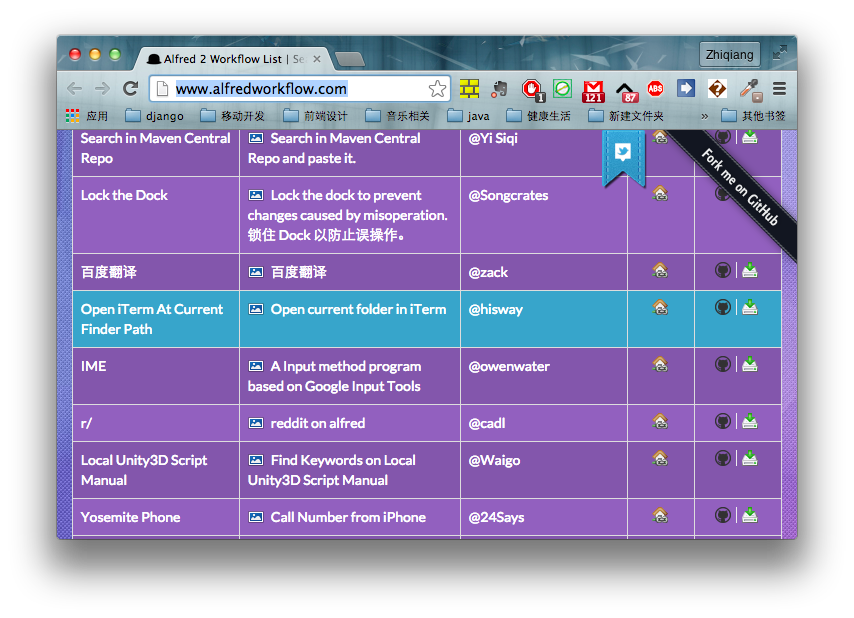
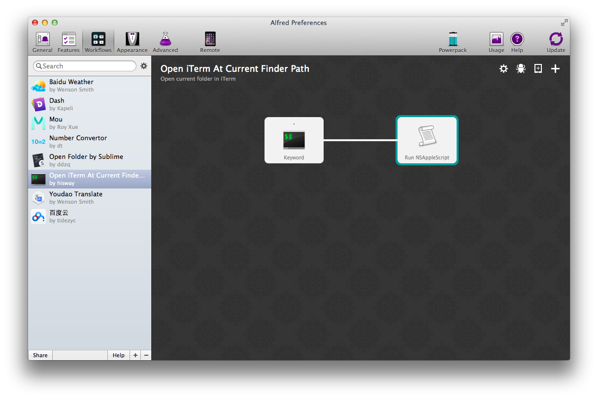
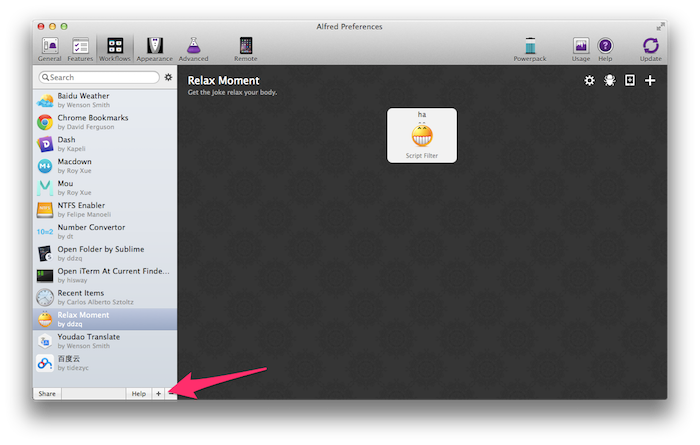
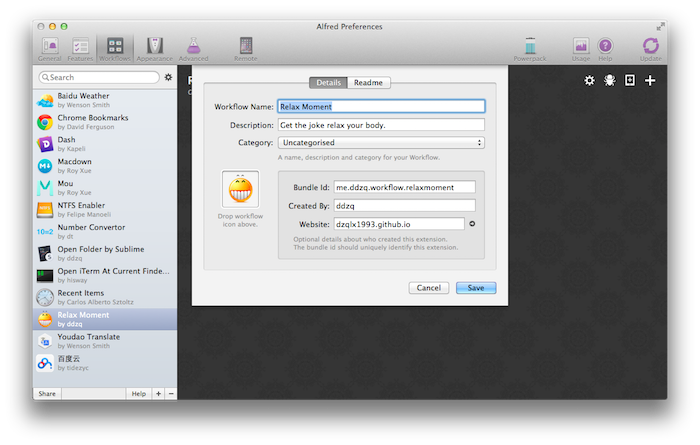
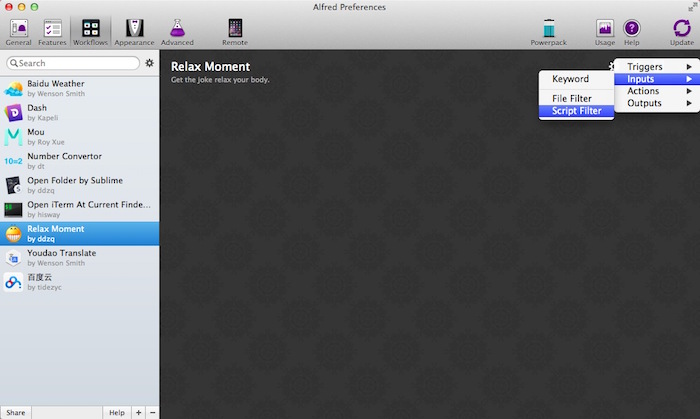
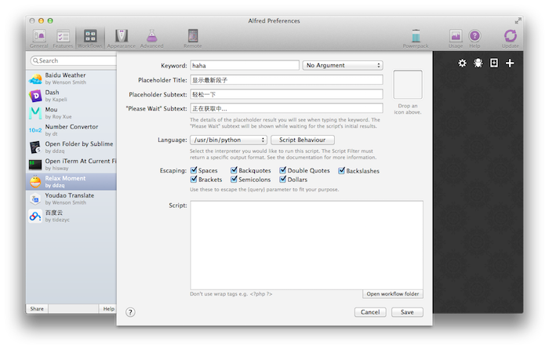
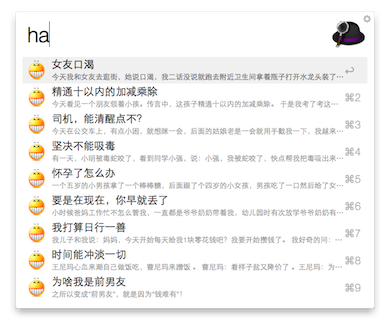

###This is two alfred workflow.

1. Use sublime open current finder path.
2. Get the joke for relax moment

近用上了alfred，感觉特别好用。尤其是workflow的功能，简直不能更赞。在网上找了下，没发现特别号的编写workflow的教程。虽然很简单，还是分享给大家，希望能帮助到更多的朋友，也希望有更多更好的workflow出现。 下面是一个简单的例子。
###第一个worklfow
> 用sublime打开当前文件夹

熟话说要学一个东西得先会模仿。现在我们要做一个用sublime打开当前finder所在文件夹的workflow。第一步当然先去<http://www.alfredworkflow.com/>看看有没有和我们相似的workflow，然后拿下改一改就好了。
 

然后我们发现一个和我们需求非常相似的，open current folder in iTerm。下载下来然后倒入到alfred看看源码。

  

可以看到如上图，关机字是`.`然后双击Run NSAppleScript就能看到源码了。可以看到源码是用appleScript写的，看起来很简单。

```python
on alfred_script(q)
	set finderPath to ""
	tell application "Finder"
		try
			set finderFolder to (folder of the front window as alias)
		on error
			set finderFolder to (path to home folder as alias)
		end try
		set finderPath to quoted form of POSIX path of finderFolder
	end tell
	tell application "iTerm"
		activate
		try
			set _session to current session of current terminal
		on error
			set _term to (make new terminal)
			tell _term
				launch session "Default"
				set _session to current session
			end tell
		end try
		tell _session
			write text "cd " & finderPath
		end tell
	end tell
end alfred_script
```

大概看懂代码也就明白是什么意思了，就是先把finderPath设置成空，然后获取当前finder所在的路径，然后告诉iterm打开并切换到这个路径。  
我们把这段代码稍微改一下，就能得到我们想要的用sublime打开当前文件夹了。在alfred的设置，workflow里面:  

1. 点击右下角的+号 --> Blank Workflow
2. 添加后选中新建的Blank Workflow 右上角点 + 号input->keyword
3. 配置好后再右上角 + Action->Run NSAppleScript
4. 然后添加下面我们修改过的代码，保存就完成了

```python
on alfred_script(q)
	set finderPath to ""
	tell application "Finder"
		try
			set finderFolder to (folder of the front window as alias)
		on error
			set finderFolder to (path to home folder as alias)
		end try
		set finderPath to quoted form of POSIX path of finderFolder
		do shell script "/Applications/Sublime' 'Text.app/Contents/SharedSupport/bin/subl " & finderPath
	end tell
end alfred_script
```

里面```do shell script "/Applications/Sublime' 'Text.app/Contents/SharedSupport/bin/subl " & finderPath```script后面是你的sublime的路径看看你的是不是这个路径，不是的话记得修改。

###第二个worflow
>查看网上笑话

程序员工作确实很累，有时候能休闲一下，来个小段子也是不错的，能放松心情，女朋友心情不好的时候复制下来，哄哄女朋友也不错。

步骤：  

1. 新建一个Blank Workflow
2. 为新建的Blank Workflow添加描述
3. 添加Script Filter
4. 编写你的script脚本
5. 添加Workflow Action

####1.新建一个Blank Workflow
  

####2. 为新建的Blank Workflow添加描述
在新建后的弹出窗口中填下worklow的相关信息。  
  
####3. 添加Script Filter
   
在弹出框中添加script的描述  
  
在language的地方可以选择/usr/bin/python或者你自己适合的语言，然后把代码放在script里面就好。不过为了调试方便，可以选择/bin/bash 这样可以在script里面写上python getjoke.py来运行。也方便调试。下面我们就要来写getjoke.py了
####4. 编写你的script脚本
选中我们的workflow右键，然后再finder中显示。   
到了文件夹后开始创建我们的python脚本。因为是用python来写，有一个python的workflow库很好用，可以去[下载最新版本](https://github.com/nikipore/alfred-python)，下载后解压后复制alfred.py到我们的workflow所在的文件夹。现在新建getjoke.py。添加代码：

```python
# -*- coding: utf-8 -*-

from bs4 import BeautifulSoup
import re
import urllib2
import alfred

def main():
    url = 'http://www.neihan8.com/lxh/'
    content = urllib2.urlopen(url).read()
    result = []
    soup = BeautifulSoup(content)
    title_list = soup.find_all("h4")
    content_list = soup.find_all("div", class_="f18 mb20")
    len = (title_list.__len__() if title_list.__len__()>content_list.__len__()
           else content_list.__len__())
    pattern = re.compile("[\u0391-\uFFE5]*")
    for i in range(len):
        title = title_list[i].contents[1].string
        result.append(alfred.Item( {"uid":alfred.uid(i)},
            title, content_list[i].string.strip(), None))
    alfred.write( alfred.xml(result))

if __name__ == "__main__":
    main()
```

因为没有api所以是抓取的数据再解析的，所以用到了beautifulsoap这个包，下载这个包复制bs4这个文件夹到workflow所在的目录即可。
  

###总结
总的来说写一个workflow就是获取你需要的数据，然后组装成一个xml文件，xml文件的格式如下:

```html
<items>
	<item uid="me.ddzq.workflow.relaxmoment-0">
		<title>女友口渴</title>
		<subtitle>
			今天我和女友去逛街，她说口渴，我二话没说就跑去附近卫生间拿着瓶子打开水龙头装了一瓶水。女友喝了还说好甜，我暗暗的笑了，又省了一块钱
		</subtitle>
	</item>
	<item uid="me.ddzq.workflow.relaxmoment-1">
		<title>精通十以内的加减乘除</title>
		<subtitle>
			今天看见一个朋友领着小孩。传言中，这孩子精通十以内的加减乘除。 于是我考了考这孩子，我就问了个5.65乘以6.56等于多少。我那朋友瞪了我一眼。我问错了么？
		</subtitle>
	</item>
</items>
```

还有其他很多action就靠大家自己研究了。  
参考资料<http://www.deanishe.net/alfred-workflow/tutorial.html>  

说明:<http://blogof.me/tech/other/2015/04/06/how-to-write-workflow-for-alfred-one//>
